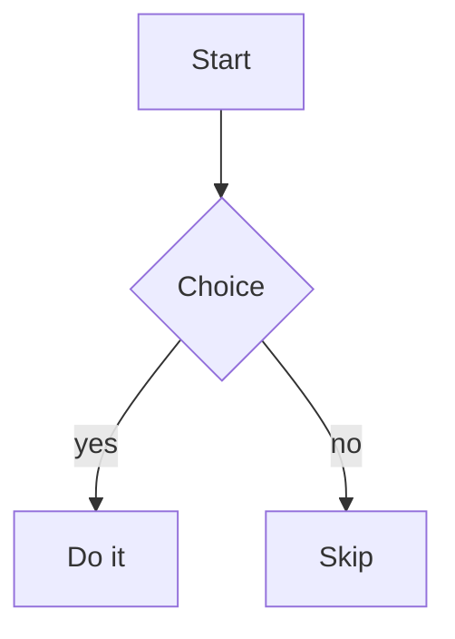
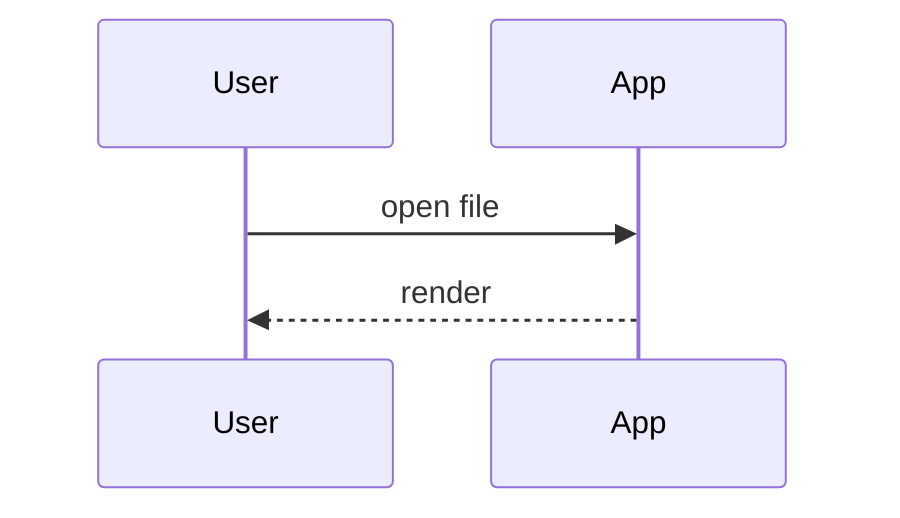

# Diagrams


```mermaid
flowchart TD
  A[Start] --> B{Choice}
  B -->|yes| C[Do it]
  B -->|no| D[Skip]
```


```mermaid
sequenceDiagram
  participant U as User
  participant A as App
  U->>A: open file
  A-->>U: render
```

Other fences:

```js
const answer = 42
```

~~~
tilde fence
~~~

```text
plain text block
```
